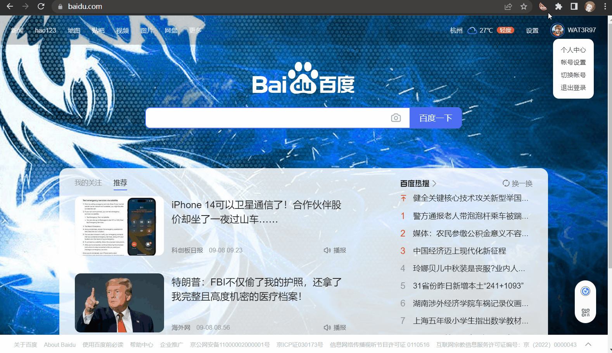

# SCAM
三国杀群内助手（Sanguosha Campaign Assistant Module）

## 项目介绍
SCAM三国杀群内助手是一款Chrome拓展程序，方便群内爱好者快速禁将，减去记禁将规则的学习成本。

## Features
* 自定义禁将: 从将池中自由选择禁将，并生成远程链接(订阅地址)分享给好友
* 添加/编辑/删除订阅地址: 添加/编辑/删除订阅地址，自定义标题和备注，自动更新最新禁将规则
* 切换规则: 在多个军八群打群内,每家禁将规则都不同？ 没关系，我们支持一键切换规则！

### 视频教程

### 效果图

## 原理
编辑禁将规则后生成新的规则json集到me7on/sgsRules  
拓展程序读取json，根据规则查找被禁武将（通过武将皮肤ID匹配），并替换图片进行遮挡    

## Contribution
因本人时间关系，以及三国杀武将更新频繁，新增武将不再维护。  
贡献源码请点这里，本仓库只用于发布crx！  
<https://github.com/suanguosha/Sinferno>

